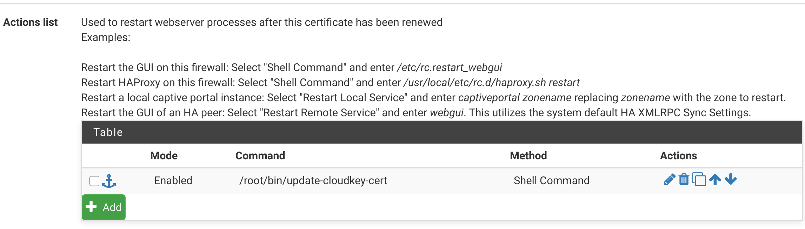

# unifi-cert-updater

If you have a Unifi system, you may wish to provide it with TLS certificates
from an external source.

In my case, I have a [pfSense] router which uses the [ACME package] to manage
and automatically renew Let's Encrypt certificates for a variety of systems,
including my Unifi controller.

The scripts in this repository can be used to automate the process of updating
the certificates used by the Unifi controller when a new certificate is issued.

[pfSense]: https://www.pfsense.org/
[ACME package]: https://docs.netgate.com/pfsense/en/latest/certificates/acme-package.html

## How it works

1. Give the pfSense root user passwordless SSH access to the Unifi controller.
2. Put `update-cloudkey-cert` in `/root/bin` on the pfSense router with
   appropriate (executable) permissions.
3. Put `update-cert` in `/root/bin` on the Unifi Cloud Key.
4. Configure a post-update action on the pfSense router which calls
   `update-cloudkey-cert`:

   

5. You're done!

## Notes and caveats

- The only remotely complicated part of what's going on here is the conversion
  of the certificate and its private key from PEM format to Java Key Store (JKS)
  format. Read `update-cert` to understand what's happening.
- Backups of the two most recent certificates will be kept on the Cloud Key
  under `/root/cert-backups`. You may need to create this directory.
- There are hard-coded hostnames and certificate names in here. If your Cloud
  Key isn't reachable with hostname `unifi`, or if your certificate name isn't
  `unifi`, you'll need to change the scripts.
- **AWOOGA AWOOGA** There are hard-coded passwords used to encrypt the
  certificate and private key, both in intermediate PKCS12 format *and* in the
  final keystore used by the Cloud Key. There is **no** meaningful protection of
  the key material on disk.
- **AWOOGA AWOOGA** Giving `root` on your router a direct path to `root` on your
  Cloud Key may be a Real Bad Idea&trade; depending on your environment. Use
  your brain.

## License

Everything in this repository is shared without warranty under the terms of the
3-Clause BSD License, a copy of which is provided in `LICENSE`.
